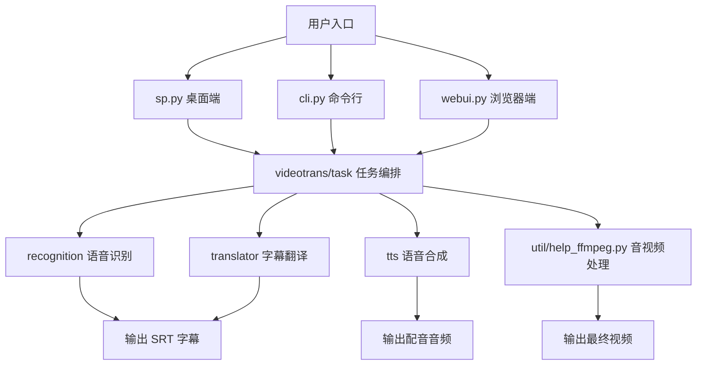
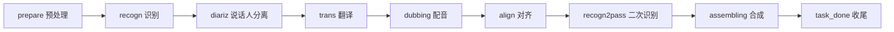

# pyVideoTrans 项目通俗讲解

本文用通俗语言解释 pyVideoTrans 这个项目在做什么、代码如何组织、核心流程如何运转，以及它背后用到的主要技术栈。

## 一句话理解

pyVideoTrans 可以理解为一个“视频翻译流水线调度器”：

```text
视频/音频/字幕输入
  -> 语音识别生成字幕
  -> 翻译字幕
  -> 生成目标语言配音
  -> 对齐音频、视频和字幕
  -> 合成最终视频或输出字幕/音频文件
```

它不是只接一个模型的简单脚本，而是把很多本地模型、云 API、桌面界面、命令行、网页界面和 FFmpeg 媒体处理能力组织到同一套任务流程里。

## 适合谁读

- 想快速理解本项目代码结构的新开发者。
- 想知道桌面版、CLI、WebUI 分别如何启动的人。
- 想搞清楚 ASR、翻译、TTS、FFmpeg 在项目里各自负责什么的人。
- 想二次开发新识别渠道、新翻译渠道、新配音渠道的人。

本文不替代完整 API 文档，也不展开每个第三方渠道的参数细节。

## 项目整体结构

从使用者角度看，项目有三个入口：

```text
桌面端 GUI     sp.py     -> PySide6 主窗口
命令行 CLI     cli.py    -> argparse 参数解析
浏览器 WebUI   webui.py  -> Gradio 页面
```

从开发者角度看，三个入口最终都会进入 `videotrans/task` 里的任务类，再调用 `recognition`、`translator`、`tts` 和 `util/help_ffmpeg.py` 完成实际处理。



## 三个运行入口

| 入口 | 文件 | 面向场景 | 通俗解释 |
|---|---|---|---|
| 桌面端 | `sp.py` | 普通用户、本地完整功能 | 启动 PySide6 桌面窗口，加载样式、图标、主窗口和后台 worker |
| 命令行 | `cli.py` | 批处理、服务器、自动化 | 把命令参数转成任务配置，然后直接调用任务类 |
| WebUI | `webui.py` | 局域网、远程访问 | 用 Gradio 做网页表单，功能范围比桌面端更集中 |

桌面端主窗口在 `videotrans/mainwin/main_win.py`。它负责初始化界面、填充识别/翻译/配音渠道下拉框、绑定按钮动作，并在 GPU 检测后启动后台处理线程。

CLI 支持四类任务：

| CLI 任务 | 对应类 | 用途 |
|---|---|---|
| `stt` | `SpeechToText` | 音频/视频转字幕 |
| `sts` | `TranslateSrt` | 字幕翻译 |
| `tts` | `DubbingSrt` | 字幕配音 |
| `vtv` | `TransCreate` | 完整视频翻译、配音、合成 |

## 核心流水线

完整视频翻译主要由 `videotrans/task/trans_create.py` 的 `TransCreate` 承担。它继承自 `BaseTask`，按阶段推进任务。

```text
prepare
  预处理，拆音频、生成无声视频、可选人声/背景声分离

recogn
  语音识别，把音频转成带时间轴的 SRT 字幕

diariz
  说话人分离，尽量判断每句话是谁说的

trans
  字幕翻译，把源语言字幕变成目标语言字幕

dubbing
  配音，把目标语言字幕逐条转成语音

align
  音画对齐，处理配音过长、视频慢速、字幕时间轴等问题

recogn2pass
  可选二次识别，对配音音频再次识别，生成更贴近配音的字幕时间轴

assembling
  最终合成，把视频、配音、背景声、字幕合并

task_done
  收尾，移动结果、清理临时文件、通知界面完成
```

对应的流程图：



并不是所有任务都会走完整链路。比如只做字幕翻译时，不需要识别、配音、合成；只做字幕配音时，不需要视频拆分和翻译。项目主要通过 `should_recogn`、`should_trans`、`should_dubbing`、`should_hebing`、`should_separate` 这些标志位决定跳过哪些阶段；二次识别另由 `TransCreate.should_recogn2` 控制。

还要注意，部分增强阶段不是严格必成。例如说话人分离、人声/背景声分离、二次识别在一些路径下失败或条件不满足时，会记录日志、关闭对应能力或跳过该阶段，主任务可能继续向后执行。

## 任务配置体系

任务参数集中在 `videotrans/task/taskcfg.py`。

| 配置类 | 负责什么 |
|---|---|
| `TaskCfgBase` | 输入文件、输出目录、缓存目录、源语言、目标语言等通用字段 |
| `TaskCfgSTT` | 语音识别参数，例如识别渠道、模型名、CUDA、降噪、说话人识别 |
| `TaskCfgSTS` | 字幕翻译参数，例如翻译渠道 |
| `TaskCfgTTS` | 配音参数，例如 TTS 渠道、音色、语速、音量、音调 |
| `TaskCfgVTT` | 完整视频翻译参数，组合 STT、STS、TTS，并增加字幕嵌入、背景音、人声分离、二次识别等字段 |

可以把它理解成：界面或命令行收集的是“用户选择”，`TaskCfg*` 把这些选择整理成“任务对象能稳定读取的标准参数”。

## 桌面端的队列和 worker

桌面端不是单线程从头跑到尾，而是使用 Qt 线程和队列。队列定义在 `videotrans/configure/config.py` 的 `AppCfg` 中，worker 定义在 `videotrans/task/job.py`。

```text
prepare_queue
  -> WorkerPrepare
  -> regcon_queue / trans_queue / dubb_queue / assemb_queue / taskdone_queue

regcon_queue
  -> WorkerRegcon
  -> diariz_queue

diariz_queue
  -> WorkerDiariz
  -> trans_queue / dubb_queue / assemb_queue / taskdone_queue

trans_queue
  -> WorkerTrans
  -> dubb_queue / assemb_queue / taskdone_queue

dubb_queue
  -> WorkerDubb
  -> align_queue

align_queue
  -> WorkerAlign
  -> regcon2_queue / assemb_queue / taskdone_queue

regcon2_queue
  -> WorkerRegcon2Pass
  -> assemb_queue / taskdone_queue

assemb_queue
  -> WorkerAssemb
  -> taskdone_queue

taskdone_queue
  -> WorkerTaskDone
```

这样做的好处是：多个视频可以排队处理，GPU 密集型阶段可以按机器能力启动多个 worker，而翻译和配音这类容易被 API 限流的阶段保持较低并发。

## 三类插件式能力：识别、翻译、配音

项目最重要的扩展点有三类：

```text
recognition  语音识别 ASR
translator   字幕翻译
tts          语音合成 TTS
```

它们都采用类似的组织方式：

1. 在各自目录的 `__init__.py` 里定义渠道编号、展示名称、配置项和实现模块路径。
2. 通过 `videotrans/__init__.py` 的 `get_class()` 动态加载具体实现类。
3. 具体渠道继承对应基类，例如 `BaseRecogn`、`BaseTrans`、`BaseTTS`。

### ASR：把声音听成文字

目录：`videotrans/recognition`

常见渠道包括 faster-whisper、openai-whisper、FunASR、Qwen ASR、Deepgram、Gemini、WhisperX、Whisper.cpp、自定义 API 等。

通俗理解：ASR 层负责“听懂视频里说了什么”，输出带时间轴的字幕列表。

### 翻译：把字幕换成目标语言

目录：`videotrans/translator`

常见渠道包括 Google、Microsoft、M2M100、ChatGPT、DeepSeek、Gemini、Azure、LocalLLM、OpenRouter、QwenMT、腾讯、百度、DeepL、阿里、Libre、自定义 API 等。

通俗理解：翻译层负责“把原字幕变成目标语言字幕”。AI 翻译渠道通常更适合处理上下文和自然表达，传统机器翻译渠道通常速度更快、成本更低。

### TTS：把文字重新念出来

目录：`videotrans/tts`

常见渠道包括 Edge-TTS、Qwen3 本地、MOSS、Piper、VITS、ChatterBox、F5-TTS、GPT-SoVITS、CosyVoice、Doubao、OpenAI、Gemini、ElevenLabs、Azure、gTTS、自定义 API 等。

通俗理解：TTS 层负责“把目标语言字幕转成语音”。部分渠道还支持声音克隆，让配音尽量接近参考声音。

## 技术栈分层图

```text
用户入口层
├─ 桌面端：sp.py + PySide6
├─ 命令行：cli.py + argparse
└─ 浏览器端：webui.py + Gradio

应用编排层
├─ videotrans/configure：全局配置、队列、日志、语言、运行环境
├─ videotrans/mainwin：桌面端主窗口和动作绑定
└─ videotrans/task：任务类、worker、批量处理、音画字幕对齐

核心能力层
├─ recognition：语音识别
├─ translator：字幕翻译、LLM 翻译
└─ tts：语音合成、声音克隆

媒体处理层
├─ FFmpeg：拆分、转码、混流、压字幕、合成视频
├─ librosa / pydub / soundfile：音频读取、裁剪、转换
├─ pyrubberband：音频变速、时长对齐
└─ videotrans/process：VAD、降噪、说话人分离等底层音频处理

模型与云服务层
├─ 本地模型：Torch、Transformers、CTranslate2、ONNXRuntime
├─ 本地 ASR/TTS：Whisper、FunASR、Piper、pyannote 等
└─ 在线 API：OpenAI、Claude、Gemini、阿里云、腾讯云、Azure、Google、DeepL 等

运行与交付层
├─ uv / pyproject.toml / uv.lock：依赖安装与锁定
├─ PyInstaller：桌面打包
├─ models/：本地模型缓存
├─ logs/：运行日志
└─ ffmpeg/：项目内置或外部音视频工具
```

## 主要目录说明

| 路径 | 作用 |
|---|---|
| `sp.py` | 桌面 GUI 启动入口 |
| `cli.py` | 命令行入口 |
| `webui.py` | Gradio WebUI 入口 |
| `videotrans/task` | 核心任务流程、worker、批量任务、音画字幕对齐 |
| `videotrans/recognition` | 语音识别渠道 |
| `videotrans/translator` | 翻译渠道 |
| `videotrans/tts` | 配音和语音合成渠道 |
| `videotrans/mainwin` | 桌面主窗口逻辑和动作处理 |
| `videotrans/ui` | PySide6 界面代码 |
| `videotrans/winform` | 各类配置窗口、渠道设置窗口 |
| `videotrans/component` | 复用 UI 组件、进度条、字幕编辑辅助 |
| `videotrans/configure` | 全局配置、运行时队列、异常、常量、信号中心 |
| `videotrans/process` | VAD、降噪、说话人分离、子进程任务等底层处理 |
| `videotrans/util` | FFmpeg、字幕、下载、GPU、角色、网络请求等工具函数 |
| `videotrans/language` | 中英文语言包 |
| `videotrans/prompts` | AI 翻译、SRT、识别等 prompt 模板 |
| `videotrans/styles` | 图标、logo、QSS、字体等资源 |
| `docs` | 用户文档和架构说明 |
| `tests` | pytest 测试 |
| `pyproject.toml` | 项目依赖和 uv 配置 |
| `uv.lock` | 锁定后的依赖版本 |

## 依赖与环境要点

`pyproject.toml` 要求 Python `>=3.10, <3.11`，实际应准备 Python 3.10.x。

项目推荐用 `uv` 管理依赖：

```bash
uv sync
```

如果需要 WebUI：

```bash
uv sync --extra webui
```

如果需要额外本地渠道，可以按需安装 extras，例如 `qwentts`、`qwenasr`、`mosstts`、`chatterbox`。

项目对 FFmpeg 依赖很重。很多看起来像“AI 功能”的步骤，最终仍需要 FFmpeg 完成真实的媒体文件处理，例如拆音频、转码、压字幕、混背景音和合成视频。

## 新开发者阅读顺序

如果你只是想理解项目，不建议一开始就看所有渠道实现。更有效的阅读顺序是：

1. `README.md`：先理解项目功能和启动方式。
2. `sp.py`、`cli.py`、`webui.py`：看三个入口分别怎么把用户操作变成任务。
3. `videotrans/task/taskcfg.py`：看任务参数如何建模。
4. `videotrans/task/_base.py`：看任务阶段的统一接口。
5. `videotrans/task/trans_create.py`：看完整视频翻译主流程。
6. `videotrans/task/job.py`：看桌面端队列和 worker 如何串起来。
7. `videotrans/recognition/__init__.py`、`videotrans/translator/__init__.py`、`videotrans/tts/__init__.py`：看渠道注册和动态加载方式。
8. 只在需要时进入具体渠道文件，例如 `_whisper.py`、`_chatgpt.py`、`_edgetts.py`。

## 二次开发提示

### 新增一个识别渠道

通常要看：

- `videotrans/recognition/__init__.py`
- `videotrans/recognition/_base.py`
- 现有识别实现文件，例如 `_whisper.py` 或 `_recognapi.py`

核心思路是：注册一个新的渠道编号和实现模块，让它继承识别基类，并返回标准字幕结构。

### 新增一个翻译渠道

通常要看：

- `videotrans/translator/__init__.py`
- `videotrans/translator/_base.py`
- 现有翻译实现文件，例如 `_chatgpt.py`、`_google.py`、`_transapi.py`

核心思路是：把一批 `SrtItem` 或 SRT 文本提交给翻译服务，再按项目需要返回对齐后的字幕列表。

### 新增一个 TTS 渠道

通常要看：

- `videotrans/tts/__init__.py`
- `videotrans/tts/_base.py`
- 现有 TTS 实现文件，例如 `_edgetts.py`、`_openaitts.py`、`_ttsapi.py`

核心思路是：接收 `queue_tts`，逐条或批量生成音频文件，保证后续 `align` 阶段能继续处理。

## 最容易混淆的点

### GUI、CLI、WebUI 不是三套业务逻辑

它们只是入口不同，核心任务类是复用的。真正的业务主干在 `videotrans/task`。

### AI 模型不是全部

项目的输出质量不仅取决于 ASR、翻译、TTS，还取决于 FFmpeg 处理、字幕时间轴、配音时长、背景音、人声分离和合成参数。

### 队列 worker 主要服务桌面端批量处理

CLI 里很多任务是直接串行调用任务方法。桌面端为了 UI 不阻塞和批量任务处理，才更明显地使用队列和 worker。

### WebUI 是简化入口

`webui.py` 适合远程或局域网使用，但完整功能仍以桌面端为主。

## 总结

这个项目的主干可以压缩成四层：

```text
入口层：桌面、命令行、网页
任务层：TaskCfg + BaseTask + TransCreate/SpeechToText/TranslateSrt/DubbingSrt
能力层：ASR、翻译、TTS 三套渠道
媒体层：FFmpeg 和音频处理工具完成最终文件加工
```

理解这四层之后，再看具体代码会容易很多：先判断一个功能属于入口、任务、能力还是媒体处理，再进入对应目录。
