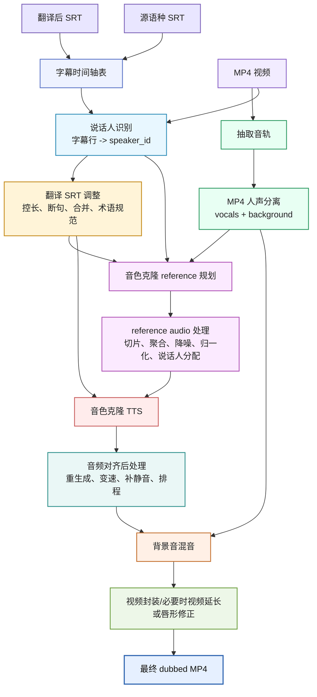

# AI 配音全流程调研报告

更新时间：2026\-06\-11

本文假设输入已经具备：

- 源语种 SRT

- 翻译后的 SRT

- 原始 MP4 视频

目标是生成一条新的配音视频：保留原视频画面和背景音，移除或压低原人声，用 AI 音色克隆 TTS 生成目标语种配音，并尽量和原字幕时间戳对齐。

## 总体流程




推荐把中间数据统一落成一张 `dubbing_tasks` 表，而不是让每个步骤直接操作 SRT：

|字段|说明|
|---|---|
|`index`|字幕序号|
|`source_start/source_end`|源字幕时间|
|`target_start/target_end`|目标配音时间预算，通常先沿用翻译 SRT 时间|
|`source_text`|源语种文本|
|`target_text_raw`|原始翻译文本|
|`target_text_adjusted`|为 TTS 控长后的文本|
|`speaker_id`|说话人识别结果，来自源字幕行归属|
|`speaker_name`|可选，说话人展示名|
|`reference_audio`|当前任务使用的音色参考|
|`reference_text`|reference audio 对应文本，如果模型需要|
|`tts_audio`|当前任务生成的 TTS 片段|
|`slot_duration`|目标时间槽时长|
|`tts_duration`|实际生成音频时长|
|`speed_factor`|后处理变速比例|
|`status`|`ok`、`needs_rewrite`、`needs_regen`、`too_long` 等|

## 1\. 翻译 SRT 调整

### 目的

这一步不是重新翻译，而是让翻译后的字幕更适合后续 TTS：

- 保持和源 SRT 的 index 对齐。

- 控制每条字幕的目标文本长度，降低 TTS 超时长概率。

- 处理过短/过长字幕，减少后续音频变速和视频延长。

- 保留语义、语气、专名、术语和人物口吻。

如果这一步不做，后续只能靠音频变速或强行挤压时间槽，对音质和自然度损伤更大。

### 可采用的方法

#### 1\.1 基于时间预算的文本控长

对每条字幕计算：

```Plaintext
slot_duration = target_end - target_start
estimated_tts_duration = estimate_duration(target_text, target_language, speaking_rate)
```

如果 `estimated_tts_duration > slot_duration * threshold`，进入压缩改写。

可选策略：

- 按目标语言设置字符/音节/词数预算。

- 用源语种时长推导目标语速预算。

- 对长句做语义压缩，优先删弱信息、重复语气词、解释性从句。

- 保留关键名词、情绪、否定、数字、称谓。

- 输出时保持原字幕 index，不随意改时间戳。

相关研究：

- [Controlling the Output Length of Neural Machine Translation](https://arxiv.org/abs/1910.10408)：研究 NMT 的输出长度控制，应用场景包括字幕和 dubbing script。

- [Jointly Optimizing Translations and Speech Timing to Improve Isochrony in Automatic Dubbing](https://arxiv.org/abs/2302.12979)：直接把翻译和语音时长一起优化，目标是改善 automatic dubbing 的 isochrony。

#### 1\.2 字幕断句、合并和时间槽修正

输入已经有源 SRT 和翻译 SRT，但翻译后的文本不一定适合 TTS。可以做：

- 过短字幕和相邻字幕合并，避免生成极短 reference/TTS。

- 过长字幕按语义断句，但保持最终时间覆盖不越界。

- 如果相邻字幕之间存在长静音，可把当前字幕尾部少量延长。

- 如果字幕有重叠，先修正时间轴，避免 TTS 排程必然冲突。

相关研究：

- [SubER: A Metric for Automatic Evaluation of Subtitle Quality](https://arxiv.org/abs/2205.05805)：把文本、分段和 timing 一起纳入字幕质量评价。

- [Direct Speech Translation for Automatic Subtitling](https://arxiv.org/abs/2209.13192)：强调自动字幕需要同时满足翻译、分段、时间戳和显示约束。

#### 1\.3 LLM 改写策略

可用任意大模型 API 做“字幕控长改写”。关键不是模型名称，而是 prompt 要明确约束：

- 输入：源文本、原译文、目标时长、当前估算时长、角色/语气。

- 输出：只返回改写后的目标语句。

- 强约束：不新增事实、不改变称谓、不改变否定、不改变数字。

- 可选约束：给出 2\-3 个压缩候选，按保真度排序。

建议在 TTS 前做两轮：

1. 轻量控长：只处理明显超预算的句子。

2. TTS 后回修：对生成后仍严重超时的句子重新压缩并重生成。

### 工程建议

MVP 阶段可以先用规则估算时长，再用 LLM 压缩明显超长的行。生产阶段再引入更细的语速模型、字幕质量评分和自动回修。

## 2\. MP4 人声分离

### 目的

从 MP4 音轨中得到：

- `vocals.wav`：用于截取 reference audio，也可用于检测原人声时段。

- `background.wav`：保留背景音乐、环境声、音效，用于最终混音。

### 开源模型和工具

#### 2\.1 Demucs / HTDemucs

Demucs 是当前工程项目中最常见的开源选择。Demucs v4 使用 Hybrid Transformer Demucs，支持分离 `drums`、`bass`、`other`、`vocals` 等 stem。官方 README 说明 v4 是 hybrid spectrogram/waveform \+ Transformer 架构，`htdemucs` 是默认模型，`htdemucs_ft` 是 fine\-tuned 版本，质量更高但更慢。[Demucs GitHub](https://github.com/facebookresearch/demucs)

相关论文：

- [Demucs: Deep Extractor for Music Sources with extra unlabeled data remixed](https://arxiv.org/abs/1909.01174)

- [Hybrid Spectrogram and Waveform Source Separation](https://arxiv.org/abs/2111.03600)

- [Hybrid Transformers for Music Source Separation](https://arxiv.org/abs/2211.08553)

适用场景：

- 视频背景中有音乐，目标是分离 vocal 和 accompaniment。

- 项目可接受本地 GPU/CPU 推理成本。

- 可离线批处理。

风险：

- Demucs 是 music source separation 模型，不是专门的电影 dialogue/music/effects 三分离模型。

- 对多人重叠、强混响、影视音效场景可能产生 bleed 和 artifact。

#### 2\.2 UVR / MDX\-Net / Open\-Unmix / Spleeter

可作为 Demucs 的替代或 ensemble：

- UVR：工程上常用的本地 GUI/CLI 集成，支持多种 MDX/Demucs 模型。

- MDX\-Net：音乐源分离挑战中常见，部分 vocal isolation 模型效果很好。

- Open\-Unmix：经典开源 baseline。

- Spleeter：轻量、老牌、速度快，但总体质量通常不如新模型。

如果最终目标是“可用的干净人声 reference”，可以同时跑 2 个模型，基于 SNR、残留伴奏、说话人相似度选择更干净的一版。

### 厂商 API

- [LALAL\.AI API](https://www.lalal.ai/api/)：提供 stem splitting、noise reduction、voice cleaner 等能力，适合不想自建 GPU 的场景。

- [ElevenLabs Audio Isolation](https://elevenlabs.io/docs/api-reference/audio-isolation)：偏音频隔离/增强，可作为人声清理或 reference cleanup 候选。

- 其他可调研项：AudioShake、Moises、Dolby\.io、iZotope RX/SpectraLayers 等。它们更偏商业音频生产或 SaaS，是否适合批量后端集成需要单独看 API、价格和授权。

### 工程建议

MVP：

- 使用 Demucs `htdemucs` 或 `htdemucs_ft` 分离 `vocals` 和 `background`。

- 输出统一转成 16k/24k/44\.1k 的中间 wav，避免后续采样率混乱。

生产：

- 增加 separation quality check。

- 对 reference audio 额外做降噪、去混响、静音裁剪。

- 必要时支持外部音轨分离 API 作为 fallback。

## 3\. 说话人识别

### 目的

把源 SRT 中的每条字幕归属到具体说话人，输出可写回 `dubbing_tasks.speaker_id` 的结果。后续 reference audio 处理可以基于 `speaker_id` 聚合同一角色的参考音色，而不是把全片或每句都当成同一个声音。

### 本项目已有 API

参考文档：

- `/Users/nickpan/Data/Projects/FY/video-dubbing-backend/reference/speaker_identify_api.md`

该服务用于根据剧集视频与字幕识别说话人，并将字幕行归属到具体说话人。任务完成后，核心结果在：

- `data.episodes[].srt[].speaker_id`

- `data.episodes[].speakers[]`

- `data.speakers[]`

对本流程最关键的是 `data.episodes[].srt[]`，其中每条字幕会保留：

- `index`

- `start`

- `end`

- `content`

- `speaker_id`

这些字段可以按 `index` 写回 `dubbing_tasks`。`data.speakers[]` 则可作为全局 speaker registry，保存角色名、描述、首次出现时间、字幕数量等信息。

### 接入位置

说话人识别应放在 reference audio 处理之前：

```Plaintext
源 SRT + MP4 或源 SRT
    -> speaker identify
    -> 源字幕 index 到 speaker_id 的映射
    -> reference audio 按 speaker 聚合
    -> TTS 每条任务按 speaker_id 选择 reference
```

如果使用完整识别接口，可以输入视频和 SRT；如果只需要基于字幕文本推断说话人，可使用 fast/SRT\-only 版本。实际使用哪一种取决于是否希望模型结合视频/音频上下文。

### 和开源 diarization 的关系

这一步也可以用 pyannote\.audio、SpeechBrain/ECAPA 等开源路线实现，但项目已有说话人识别 API 时，工程上可以先把它作为主路径：

- API 路线：直接得到字幕行级 `speaker_id`，便于接入后续任务表。

- 开源 diarization 路线：先得到 audio turns，再按字幕时间重叠映射到字幕行。

两者可以并存。生产系统中可以把 API 结果作为主结果，把开源 diarization 作为 fallback 或 QA 交叉验证。

## 4\. 音色克隆 Reference Audio 处理

### 目的

为音色克隆 TTS 准备稳定、干净、长度合适、说话人一致的 reference audio。

这里的核心问题是：reference audio 应该按什么粒度取？

### Reference 选取策略

|策略|做法|适合场景|风险|
|---|---|---|---|
|用户指定 reference|用户上传固定声音样本|明确要统一换声或指定角色声音|多角色会被统一成一个声音|
|speaker\-level reference|先识别 speaker，再为每个 speaker 聚合 reference|多角色、长视频、需要角色音色稳定|依赖说话人识别质量|
|line\-level reference|每条字幕按时间切一段 reference|实现简单，局部贴近原句|短句、不干净、多人重叠会导致逐句漂移|
|global merged reference|从全片选若干干净片段合并成一个 reference|单人视频、主讲视频|多人视频会混音色|

本项目已有参考文档：

- `/Users/nickpan/Data/Projects/FY/video-dubbing-backend/reference/voice_clone_reference_audio_selection.md`

该文档对比了 tachidubb、pyVideoTrans、VideoLingo 的 reference audio 选取方式。

### 如果输入 SRT 没有 speaker\_id

输入只有源 SRT、翻译 SRT 和 MP4 时，源 SRT 通常没有 speaker 信息。可选路线：

1. 单人假设：所有字幕使用一个 global reference。

2. 主讲人模式：从最长/最干净的片段构建主 speaker reference。

3. 使用项目已有说话人识别 API，从 `data.episodes[].srt[].speaker_id` 读取字幕行归属。

4. 开源 fallback：对 MP4 音频跑 speaker diarization，再按字幕时间重叠给每条字幕分配 speaker。

### 可采用的模型和工具

#### 4\.1 Speaker diarization

- [pyannote\.audio](https://arxiv.org/abs/1911.01255)：开源 speaker diarization 工具链，包含 VAD、speaker change detection、overlap detection、speaker embedding 等模块。

- SpeechBrain / ECAPA\-TDNN：常用于 speaker embedding 和 speaker verification。[ECAPA\-TDNN paper](https://arxiv.org/abs/2005.07143)

用途：

- 给字幕行分配 `speaker_id`。

- 过滤 reference 中混入其他 speaker 的片段。

- 聚合同一 speaker 的多段 reference。

#### 4\.2 VAD 和强制对齐

- Silero VAD / WebRTC VAD：用于裁掉 reference 前后静音，过滤非语音片段。

- [WhisperX](https://arxiv.org/abs/2303.00747)：可提供 word\-level timestamps 和 forced phoneme alignment，用于检查源字幕/音频是否对齐。

- [Montreal Forced Aligner](https://montreal-forced-aligner.readthedocs.io/en/latest/)：经典强制对齐工具，可用于更严格的音素/词级边界。

- [aeneas](https://github.com/readbeyond/aeneas)：音频和文本同步工具，适合一些有完整文本的对齐场景。

- [ElevenLabs Forced Alignment](https://elevenlabs.io/docs/api-reference/forced-alignment)：厂商 API，可直接返回 character/word timing。

### Reference 清理建议

建议对 reference audio 做统一处理：

- 切片来源优先使用 `vocals.wav`，而不是原始混音。

- 裁掉首尾静音。

- 过滤过短片段：低于 2\-3s 的片段通常不适合作为独立 clone reference。

- 限制过长片段：多数 zero\-shot TTS 使用 5\-20s reference 已足够。

- 做响度归一化，例如 EBU R128 loudnorm。

- 做 highpass/lowpass，去掉低频 rumble 和高频噪声。

- 对每个 speaker 做 embedding 一致性检查，避免混入其他 speaker。

- 如果 TTS 模型需要 `reference_text`，尽量使用该 reference 对应的源字幕文本；跨语言模型如果容易延续源语言音素，则应测试 reference\-only 模式。

## 5\. 音色克隆 TTS

### 目的

对每条调整后的目标字幕生成目标语种配音片段：

```Plaintext
input = target_text_adjusted + reference_audio + optional_reference_text + language/style/speed
output = tts_segment.wav
```

### 开源模型

#### 5\.1 F5\-TTS

[F5\-TTS](https://arxiv.org/abs/2410.06885) 是基于 flow matching 和 Diffusion Transformer 的 zero\-shot TTS。论文强调其 fully non\-autoregressive、无需复杂 duration model / phoneme alignment，并具备自然度、zero\-shot、code\-switching 和速度控制能力。

适合：

- 自托管。

- 需要 zero\-shot voice cloning。

- 希望对语速有一定控制。

注意：

- 通常需要 reference audio 和 reference text。

- 跨语言 clone 时要关注 reference text 依赖和发音稳定性。

#### 5\.2 CosyVoice / CosyVoice2

[CosyVoice](https://arxiv.org/abs/2407.05407) 是多语言 zero\-shot TTS，使用 supervised semantic tokens；[CosyVoice2](https://arxiv.org/abs/2412.10117) 进一步强调 streaming、低延迟和大规模多语言训练。

适合：

- 中文/多语言场景。

- 需要 streaming 或低延迟。

- 希望本地或私有化部署。

#### 5\.3 GPT\-SoVITS

GPT\-SoVITS 在开源社区常用于少样本音色克隆。工程上通常给它传：

- `text`：目标语种文本。

- `ref_audio`：参考音频。

- `prompt_text`：参考音频对应文本。

- `prompt_lang` / `text_lang`：源参考语言和目标语言。

适合：

- 中文社区生态。

- 对 voice clone 质量要求较高，且可接受部署复杂度。

#### 5\.4 OpenVoice

[OpenVoice](https://arxiv.org/abs/2312.01479) 强调短音频 instant voice cloning、跨语言 voice cloning、以及 emotion/accent/rhythm/pauses/intonation 等 style control。

适合：

- 希望把“音色”和“风格”分开控制。

- 需要跨语言 cloning。

#### 5\.5 Fish Speech / Fish Audio S2

[Fish Speech](https://arxiv.org/abs/2411.01156) 是 FishAudio 开源的多语言 TTS / voice cloning 模型，技术报告中描述其使用 Dual\-AR 架构和 GFSQ 音频 tokenizer，并强调 multilingual TTS、voice cloning 和复杂语言场景处理能力。FishAudio 后续的 [S2 technical report](https://arxiv.org/abs/2603.08823) 进一步强调 multi\-speaker、multi\-turn generation、自然语言 instruction control、streaming inference，以及开源模型权重和推理引擎。

Fish Speech / Fish Audio S2 对视频配音比较有价值的点：

- 支持多语言 TTS 和短 reference 的 voice cloning。

- 支持情绪/语气标签，适合配音中控制表达方式。

- S2 文档强调 multi\-speaker generation，可作为多角色配音方向的候选。

- 可以走自托管路线，也可以走 Fish Audio 平台/API 路线。

注意：

- 开源仓库使用 Fish Audio Research License，商业使用和模型权重授权需要单独确认。

- 对齐能力仍需要外部流程保障，不能假设生成音频天然匹配字幕时长。

#### 5\.6 RVC / Voice Conversion 路线

RVC 是 speech\-to\-speech voice conversion 思路，不是标准 TTS：

1. 先用普通 TTS 生成目标语音。

2. 再用 voice conversion 把声音转成目标 speaker 音色。

优点：

- 可以保留 TTS 的稳定发音，再做音色转换。

风险：

- 需要目标 speaker 数据训练或适配。

- 对实时性、音质、授权和误用风险要求更高。

### 厂商 API

#### 5\.7 ElevenLabs

- [Create IVC Voice](https://elevenlabs.io/docs/api-reference/voices/add)：上传多个音频样本创建 instant voice clone。

- [Dubbing API](https://elevenlabs.io/docs/api-reference/dubbing/create)：提供端到端 dubbing 能力，可上传视频/音频，也支持 CSV transcription/translation metadata。

- [Forced Alignment](https://elevenlabs.io/docs/api-reference/forced-alignment)：可返回 word/character timing，用于 QA 或二次对齐。

适合：

- 快速上线。

- 质量和稳定性优先。

- 可以接受云端成本和合规要求。

#### 5\.8 Fish Audio

[Fish Audio](https://fish.audio/) 是 FishAudio 的云端语音平台，提供 text\-to\-speech、voice cloning、speech\-to\-text、voice agent 等能力。官网强调 Fish Audio S2 支持情绪标签、实时语音生成、voice cloning，并提供开发者 API；其页面说明 voice cloning 可以用较短音频样本创建克隆声音，API 支持 text\-to\-speech 和 voice cloning。

适合：

- 希望使用 FishAudio 模型能力，但不想自托管。

- 需要情绪标签、角色化配音或多语言 voiceover。

- 快速验证 Fish Speech / S2 在视频配音里的效果。

注意：

- 作为厂商 API 使用时，需要确认价格、并发、数据保留、商用授权和 voice cloning 授权流程。

- 如果和自托管 Fish Speech 混用，需要统一 reference audio 格式和任务数据结构。

#### 5\.9 Microsoft Azure Custom Neural Voice

[Azure Custom Neural Voice](https://learn.microsoft.com/en-us/azure/ai-services/speech-service/custom-neural-voice) 是微软的 custom voice 方案。官方文档说明它需要申请访问权限，创建高质量 custom voice 需要录音样本、脚本、voice talent consent、训练、测试和部署；创建 high\-quality voice model 建议至少 300 utterances。

适合：

- 企业品牌声音。

- 合规、授权和稳定性优先。

- 可接受训练流程，而不是 instant cloning。

#### 5\.10 Cartesia

[Cartesia Clone Voice](https://docs.cartesia.ai/api-reference/voices/clone) 提供 voice clone API，输入 audio clip、name、description、base\_voice\_id 等字段，返回 voice id。

适合：

- 实时 TTS / voice agent 场景。

- 希望使用 API 创建和复用 voice。

#### 5\.11 OpenAI TTS

[OpenAI Text\-to\-Speech](https://platform.openai.com/docs/guides/text-to-speech) 提供 `gpt-4o-mini-tts`、`tts-1`、`tts-1-hd` 等 TTS 模型和内置声音，可通过 instructions 控制 accent、emotion、intonation、speed、tone 等。当前公开文档侧重点是内置声音和可控 TTS，不是上传 reference audio 的音色克隆。

适合：

- 不要求 clone 原 speaker 音色。

- 需要稳定、简单、可控的普通 TTS。

## 6\. 音频/视频变速对齐后处理

### 目的

TTS 生成音频通常不会天然等于字幕时间槽。后处理需要解决：

- 生成音频比时间槽长。

- 生成音频比时间槽短。

- 相邻字幕之间发生重叠。

- 总配音时长超过原视频。

- 目标音频和口型/画面动作不一致。

### 对齐策略优先级

推荐优先级：

1. 翻译阶段控长，避免生成超长音频。

2. TTS 阶段使用 speed/rate 控制。

3. 轻度音频 time\-stretch。

4. 插入静音或压缩间隔。

5. 重新改写目标文本并重生成。

6. 必要时延长视频或做 lip\-sync。

不要把所有问题都交给 `atempo`。大比例变速会明显损伤音质和自然度。

### 6\.1 Segment\-level 排程

每条字幕有一个目标时间槽：

```Plaintext
slot_start = target_start
slot_end = target_end
slot_duration = slot_end - slot_start
tts_duration = duration(tts_audio)
```

可采用：

- 如果 `tts_duration <= slot_duration`：按 `slot_start` 放置，尾部补静音。

- 如果轻微超出：对音频做 time\-stretch。

- 如果严重超出：回到翻译调整，缩短文本并重生成。

- 如果前一条已经推迟当前条：可选择整体 greedy schedule 或局部重排。

### 6\.2 音频 time\-stretch

工具：

- [FFmpeg atempo](https://ffmpeg.org/ffmpeg-filters.html#atempo)：官方文档说明 `atempo` 用于调整音频 tempo，参数范围是 `[0.5, 100.0]`，但大于 2 时会跳过部分样本，必要时应串联多个 `atempo`。

- [Rubber Band Library](https://breakfastquay.com/rubberband/)：开源 time\-stretch 和 pitch\-shift 库，通常比简单 `atempo` 更适合高质量变速。

建议：

- 对语音配音，优先限制在约 `0.85x - 1.20x`。

- 超过 `1.25x` 时优先重写文本，而不是继续压缩音频。

- 对非常短的片段不要强行变速，优先补静音或合并字幕。

### 6\.3 强制对齐和 QA

TTS 后可再次做 forced alignment：

- 检查生成音频是否漏词、错词。

- 检查 word\-level timing 是否异常。

- 更新最终字幕时间。

- 对 dubbing 质量做自动评分。

可选工具：

- WhisperX：word\-level timestamps 和 forced phoneme alignment。

- Montreal Forced Aligner：更传统、严谨的强制对齐。

- ElevenLabs Forced Alignment：API 路线，直接给 word/character timing。

相关研究：

- [WhisperX: Time\-Accurate Speech Transcription of Long\-Form Audio](https://arxiv.org/abs/2303.00747)

- [Tradition or Innovation: A Comparison of Modern ASR Methods for Forced Alignment](https://arxiv.org/abs/2406.19363)

### 6\.4 视频处理

最终混音：

```Plaintext
final_audio = aligned_tts_voice + background_audio
```

可选处理：

- 背景音 ducking：TTS 出现时压低背景音乐/环境音。

- loudnorm：统一响度。

- sidechain compression：让配音更清晰。

- 原人声残留较多时，对 background 再做 voice suppression 或 EQ。

如果最终音频超过视频长度：

- 轻微超出：freeze 最后一帧延长视频。

- 多处超出：回到文本控长或 TTS 重生成。

- 对口型要求高：考虑 lip\-sync 模型。

可选 lip\-sync 模型：

- [Wav2Lip](https://arxiv.org/abs/2008.10010)：经典 talking face lip\-sync 模型。

- [Diff2Lip](https://arxiv.org/abs/2308.09716)：扩散模型路线，强调视觉质量和同步。

## 推荐落地方案

### MVP 方案

适合先做可用版本：

1. 解析源 SRT 和翻译 SRT，按 index 对齐成 `dubbing_tasks`。

2. 调用说话人识别 API，拿到字幕行级 `speaker_id`；如果暂不接入，则先走单 speaker 假设。

3. 对目标文本做基于时长预算的 LLM 压缩。

4. 使用 Demucs `htdemucs` 或 `htdemucs_ft` 分离 `vocals/background`。

5. 按 `speaker_id` 聚合 reference；没有 speaker 信息时，从最长、最干净的人声片段合并 global reference。

6. 使用一个 clone TTS backend，例如 F5\-TTS、CosyVoice2、GPT\-SoVITS、Fish Speech/Fish Audio 或 ElevenLabs IVC。

7. 对每条 TTS 音频做轻度 time\-stretch，超过阈值则重写并重生成。

8. 将配音音轨和 background 混音，封装回 MP4。

### 生产方案

适合多角色、长视频、稳定质量：

1. 引入 speaker diarization 或说话人识别服务。

2. 构建 speaker\-level reference bank。

3. 每条字幕绑定 `speaker_id` 和 `speaker_reference_wav`。

4. 额外保留 `segment_reference_wav` 作为 fallback 或局部风格参考。

5. TTS 后做 forced alignment 和 ASR 回检。

6. 对超长片段自动进入“改写 \-\> 重生成 \-\> 轻度变速”的闭环。

7. 建立音频 QA 指标：时长误差、漏词率、speaker similarity、响度、clip、重叠率。

## 阶段选型表

|阶段|本地开源优先|API 优先|推荐判断|
|---|---|---|---|
|翻译 SRT 调整|规则 \+ LLM|LLM API|优先 API，成本低且收益大|
|人声分离|Demucs / UVR / MDX\-Net|LALAL\.AI / Audio Isolation|有 GPU 用本地；无 GPU 用 API|
|说话人识别|pyannote / ECAPA|说话人识别 API|优先使用已有 API，结果直接写入 `speaker_id`|
|reference 处理|VAD / FFmpeg / speaker embedding|forced alignment API|按 `speaker_id` 聚合 reference，多 speaker 场景不要只用 global ref|
|音色克隆 TTS|F5\-TTS / CosyVoice2 / GPT\-SoVITS / Fish Speech / OpenVoice|ElevenLabs / Fish Audio / Azure / Cartesia|MVP 可先 API；长期看成本和隐私|
|对齐后处理|FFmpeg / Rubber Band / MFA / WhisperX|ElevenLabs Forced Alignment|对齐尽量规则化，严重超时回到文本|
|视频修复|freeze frame / Wav2Lip|商业 lip\-sync/dubbing 服务|没有强口型要求时先不做 lip\-sync|

## 关键风险

1. 翻译文本没有控长，TTS 后只能强行变速，或在 SRT 控长步骤中对翻译内容会产生质量上的降低

2. 人声分离残留背景声，会污染 reference audio，多说话人重叠，目前没有好的结局方式。

3. 音色克隆中，line\-level reference 太短，会导致音色逐句漂移，使用多 reference 无法获得精准的情绪复刻。同时音色克隆是目前的标准方案，但缺点就是前后容易产生音色漂移。

4. 生成音频与视频时间轴的差异，在后处理（如缩放音频、视频）等过程中容易产生效果上的问题。

## 参考资料

### 字幕调整和 dubbing isochrony

- [Controlling the Output Length of Neural Machine Translation](https://arxiv.org/abs/1910.10408)

- [Jointly Optimizing Translations and Speech Timing to Improve Isochrony in Automatic Dubbing](https://arxiv.org/abs/2302.12979)

- [SubER: A Metric for Automatic Evaluation of Subtitle Quality](https://arxiv.org/abs/2205.05805)

- [Direct Speech Translation for Automatic Subtitling](https://arxiv.org/abs/2209.13192)

### 音轨分离

- [Demucs GitHub](https://github.com/facebookresearch/demucs)

- [Demucs: Deep Extractor for Music Sources with extra unlabeled data remixed](https://arxiv.org/abs/1909.01174)

- [Hybrid Spectrogram and Waveform Source Separation](https://arxiv.org/abs/2111.03600)

- [Hybrid Transformers for Music Source Separation](https://arxiv.org/abs/2211.08553)

- [LALAL\.AI API](https://www.lalal.ai/api/)

- [ElevenLabs Audio Isolation](https://elevenlabs.io/docs/api-reference/audio-isolation)

### 说话人识别、VAD、强制对齐

- [pyannote\.audio: neural building blocks for speaker diarization](https://arxiv.org/abs/1911.01255)

- [ECAPA\-TDNN](https://arxiv.org/abs/2005.07143)

- [WhisperX](https://arxiv.org/abs/2303.00747)

- [Montreal Forced Aligner](https://montreal-forced-aligner.readthedocs.io/en/latest/)

- [aeneas](https://github.com/readbeyond/aeneas)

- [ElevenLabs Forced Alignment](https://elevenlabs.io/docs/api-reference/forced-alignment)

### 音色克隆和 TTS

- [F5\-TTS](https://arxiv.org/abs/2410.06885)

- [CosyVoice](https://arxiv.org/abs/2407.05407)

- [CosyVoice2](https://arxiv.org/abs/2412.10117)

- [OpenVoice](https://arxiv.org/abs/2312.01479)

- [Fish Speech](https://arxiv.org/abs/2411.01156)

- [Fish Audio S2 Technical Report](https://arxiv.org/abs/2603.08823)

- [Fish Speech GitHub](https://github.com/fishaudio/fish-speech)

- [Fish Audio](https://fish.audio/)

- [ElevenLabs IVC](https://elevenlabs.io/docs/api-reference/voices/add)

- [ElevenLabs Dubbing](https://elevenlabs.io/docs/api-reference/dubbing/create)

- [Azure Custom Neural Voice](https://learn.microsoft.com/en-us/azure/ai-services/speech-service/custom-neural-voice)

- [Cartesia Clone Voice](https://docs.cartesia.ai/api-reference/voices/clone)

- [OpenAI Text\-to\-Speech](https://platform.openai.com/docs/guides/text-to-speech)

### 对齐后处理和视频修复

- [FFmpeg atempo](https://ffmpeg.org/ffmpeg-filters.html#atempo)

- [Rubber Band Library](https://breakfastquay.com/rubberband/)

- [Wav2Lip](https://arxiv.org/abs/2008.10010)

- [Diff2Lip](https://arxiv.org/abs/2308.09716)
